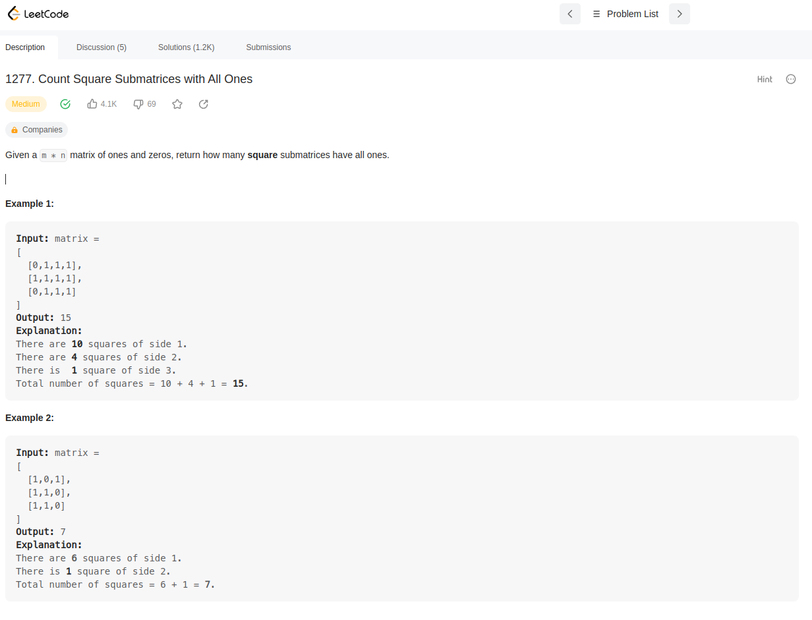
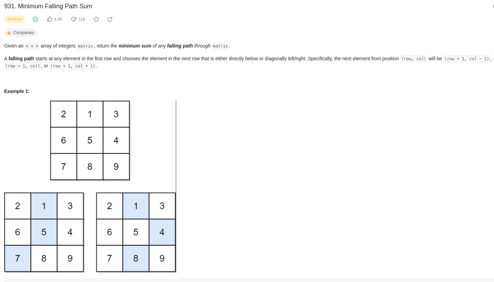
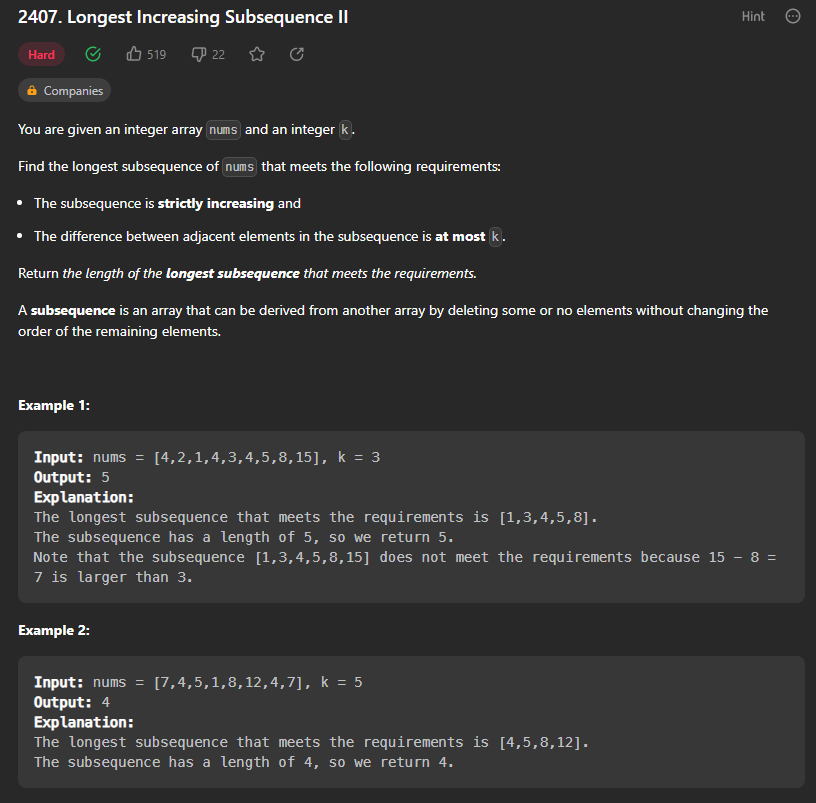
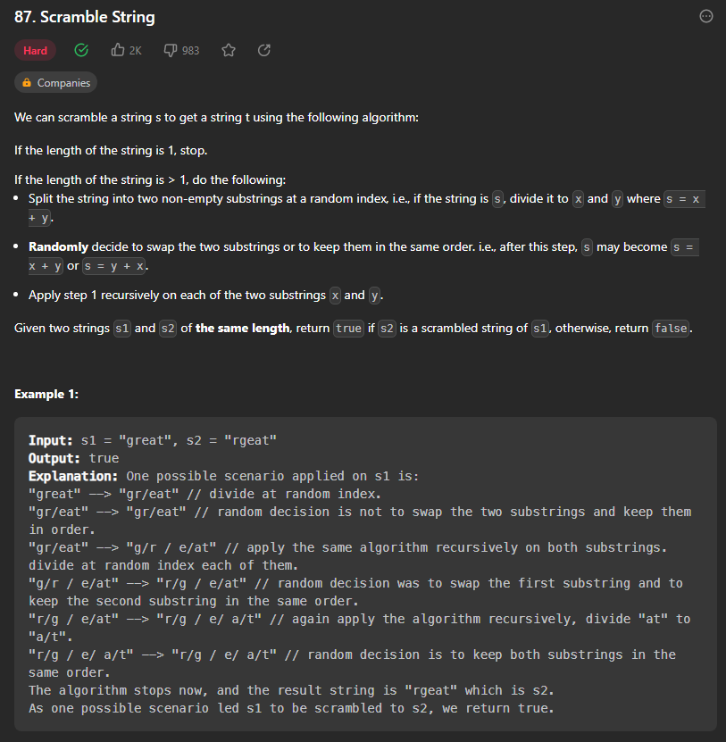
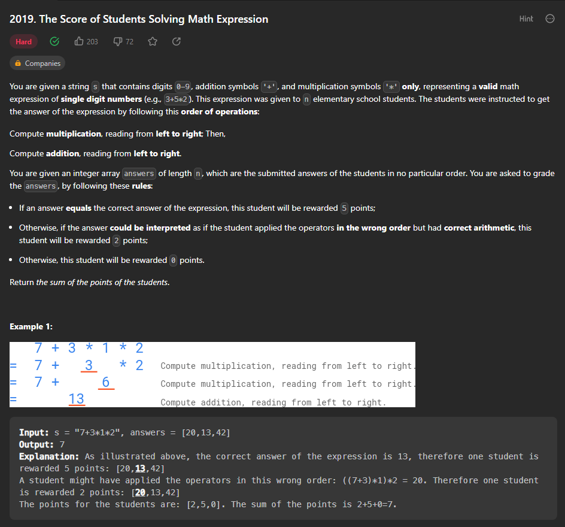

# PD_Dupla_6_Exercicios

**Número da Lista**: 6 
**Conteúdo da Disciplina**: Programação Dinâmica 

## Alunos
|Matrícula | Aluno |
| -- | -- |
| 19/0056843  |  Carlos Eduardo de Sousa Fiuza |
| 19/0055201  |  Matheus Calixto Vaz Pinheiro |

## Sobre 
O projeto consiste na resolução de alguns problemas de programação categorizados como "Dynamic Programming" usando abordagens de algoritmos de programação dinâmica.
Cada pasta do repositório com prefixo "problem" é um problema resolvido. Para detalhes acesse o readme de cada pasta.

## Screenshots

    </img>

    </img>

    </img>

    </img>

    </img>

## Instalação 
Necessário possuir Node para execução das soluções.

## Apresentação
[O vídeo pode ser encontrado aqui.](/assets/presentation.mp4)

